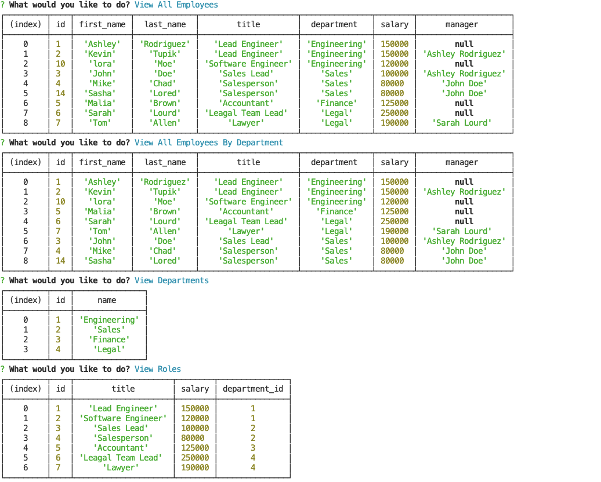
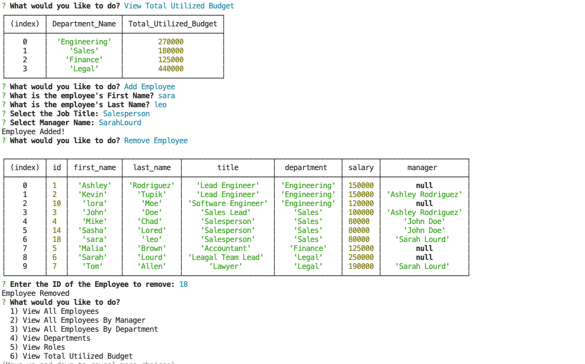

# Employee-Tracker
[](https://docs.github.com/en/github/creating-cloning-and-archiving-repositories/licensing-a-repository#searching-github-by-license-type)

## Description:
Application that managing a company's employees using node, inquirer, and MySQL.

  ## Table of Contents:
  * [Installation](#installation)
  * [Usage](#usage)
  * [Screenshots](#screenshots)
  * [Walkthrough-Video](#walkthrough-video)
  * [License](#license)
  * [Contributing](#contributing)
  * [Questions](#questions)
  
  ## Installation:
  We need to make sure that our repo contain `package.json` with the required dependencies to get these files we need to apply the following commands:
  * ``` npm init ``` to install the package.json.
  * ``` npm i inquirer ``` installing inquirer package.
  * ``` npm i mysql ``` installing MYSQL package.

  ## Usage:
  * open the terminal.
  * make sure you are in the right directory.
  * In the command line type node followed by the name of the file, like the command bellow: 

  ```
  node employeeTracker.js  
  ```
  
  ## Screenshots:
  
  

  ## Walkthrough Video:
  Check this video that demonstrates the functionality of the application:<br />
   [Walkthrough-Video](https://drive.google.com/file/d/1tR8jWAJLhdlABAPt2nMDhwHOPl48ErhS/view?usp=sharing)
  
  
  ## License:
  This project is convered under the MIT License.

  ## Contributing:
  Contributions are accepted. Feel free to fork.
 

  ## Questions:
  For any questions, additional help or questions about collaboration, please contact me with the information below:
 
  * GitHub: [GitHub-Profile](https://github.com/asia-codeing)
  * Portfolio: [My-Portfolio](https://asia-codeing.github.io/my-Portfolio/)
  * Email: asia.alius@gmail.com